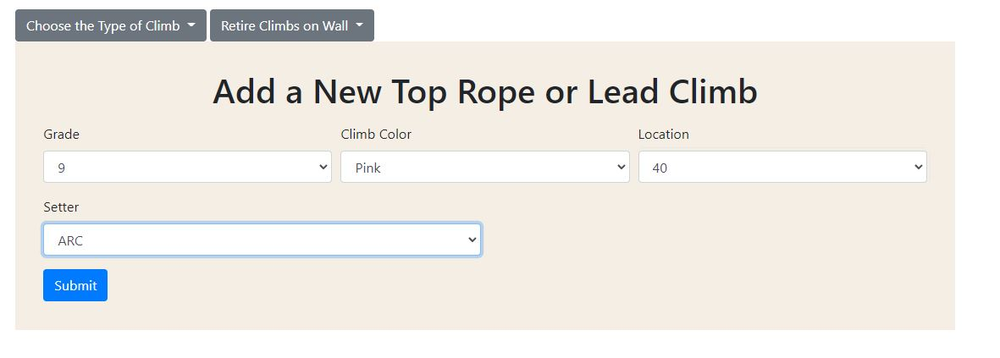
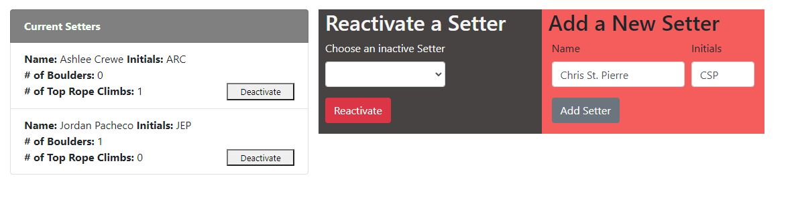
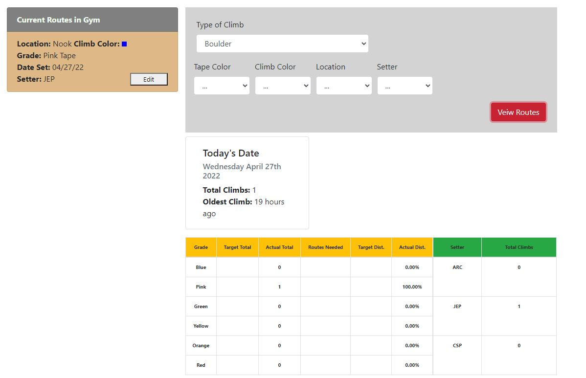

# TRC CurrentRouteTracker

## Table of Contents
* [Description](#description)
* [Technologies](#technologies)
* [Features](#features)
* [Upcoming Features](#upcoming-features)

---

## Description

This app is designed to be a private database for the <b>The Rock Club</b> to use to view the current routes in their gym. 

---

## Technologies
* CSS
* Express
* HTML
* Javascript
* JQuery
* MongoDB
* Mongoose
* Moment.js

---

## Features

> <b>Add a Climb</b>
  * Allows User to add boulder & top rope routes to database
  * specifies grade, climb color, setter, and location in the gym
  * allows user to clear a specific wall of climbs to add new climbs

> <b>Setters Page</b>
  * Add new setters to database
  * Deactivate/reactivate Setters as they leave or rejoin team
  * Veiw the number of climbs set by active setters

> <b>Current Routes</b>
  * Veiw full list of active Top Rope/Boulder Climbs
  * Show the how old the oldest climb in the gym is
  * Create table with the # of climbs based off grades & setters
  * Displays bar graph of current Boulder Climbs

---

## Upcoming Features
> <b>Home Page</b>
  * *Gym Snapshot* - Shows total # of active climbs in the gym 
  * *Table Data* - Loads bar graph with the # of Active climbs in the gym
  * *Latest Set* - Displays last 5 climbs set
> <b>Current Routes</b>
  * *Filter* - Filter climb list and table by specific grade, setter, climb color, or wall
  * *Top Rope Chart* - Display bar graph of current Top Rope climbs
  * *Target Total* - Allow user to change the target totals of # of climbs in the gym
  * *Inactive Climbs* - Allow user to check inactive climbs and reactivate them

---

## Questions
  
 For any questions, contact me at 

  <h3> Email : </h3>
  <strong>mckoyc@gmail.com</strong>
    
  <h3> Github Account:</h3>
  
  [mckoyc94](https://github.com/mckoyc94)

---

[Back To Top](#trc-currentroutetracker)
